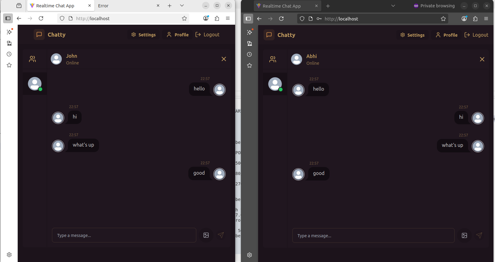

# Full-Stack Chat Application

This project implements a full-stack chat application designed with a three-tier architecture. It comprises:

- **Database Layer (Tier 1):** Powered by MongoDB, responsible for data storage and retrieval.
- **Backend API Layer (Tier 2):** A Node.js application that handles business logic, API endpoints, and interacts with the MongoDB database.
- **Frontend Presentation Layer (Tier 3):** A React.js application providing the user interface and interacting with the backend API.

The entire application is orchestrated using docker and Kubernetes for local development and deployment.

### Architecture Diagram


## Project Structure

- `backend/`: Contains the Node.js backend application.
  - `src/`: Source code for the backend, including controllers, models, routes, and middleware.
  - `Dockerfile`: Dockerfile for the backend service.
  - `package.json`: Backend dependencies and scripts.

- `frontend/`: Contains the React frontend application.
  - `src/`: Source code for the React app, including components, pages, and state management.
  - `public/`: Static assets like images and the `index.html`.
  - `Dockerfile`: Dockerfile for the frontend service.
  - `nginx.conf`: Nginx configuration for serving the frontend.
  - `package.json`: Frontend dependencies and scripts.
  - `vite.config.js`: Vite configuration for the React app.
  - `tailwind.config.js`, `postcss.config.js`, `eslint.config.js`: Configuration files for styling and linting.

- `docker-compose.yml`: Defines the multi-container Docker application, including backend, frontend, and potentially a database.

- `k8s/`: Contains Kubernetes deployment configurations for deploying the application to a Kubernetes cluster.
  - `backend-dp.yml`: Defines the deployment and service for the backend application, ensuring it's scalable and accessible within the cluster.
  - `frontend-dp.yml`: Defines the deployment and service for the frontend application, making it available to users.
  - `mongodb-dp.yml`: Defines the deployment and service for the MongoDB database, providing persistent storage for the application's data.
  - `mongodb-pv.yml`: Defines a Persistent Volume (PV) for MongoDB, abstracting the underlying storage details.
  - `mongodb-pvc.yml`: Defines a Persistent Volume Claim (PVC) for MongoDB, requesting storage from the PV.
  - `namespace.yml`: Defines a dedicated Kubernetes namespace for the application, helping to organize and isolate resources.
  
- `Jenkinsfile`: Jenkins pipeline definition for CI/CD.
- `.env`: Environment variables for the application.
- `.gitignore`: Specifies intentionally untracked files to ignore.
- `LICENSE`: Project license.

## Technologies Used

**Frontend:**
- React
- Vite (build tool)
- Tailwind CSS (for styling)
- Redux (likely for state management, based on `store/` directory)

**Backend:**
- Node.js
- Express.js (common for Node.js APIs, inferred from `controllers/`, `routes/`, `middleware/`)
- MongoDB (likely, inferred from `models/` and `seeds/`)

**DevOps/Infrastructure:**
- Docker & Docker Compose
- Jenkins (for CI/CD)
- Nginx (for serving frontend)

## Setup and Running Locally

To deploy this project locally, a development environment using Minikube is recommended. The following tools are required:
- Docker
- Minikube
- Kind
- kubectl

1.  **Clone the repository:**
    ```bash
    git clone <repository-url>
    cd full-stack_chatApp
    ```

2.  **Environment Variables:**
    Create a `.env` file in the root directory based on `.env.example` (if available) or define necessary variables like database connection strings, API keys, etc.

3.  **Start Minikube:**
    ```bash
    minikube start --driver=docker
    ```

4.  **Verify Minikube Nodes:**
    ```bash
    minikube get nodes
    ```

6.  **Docker Login (if pushing images to a private registry):**
    ```bash
    docker login
    ```

7.  **Build Docker Images:**
    Navigate to the `backend` directory and build the backend image:
    ```bash
    cd backend
    docker build -t <your-dockerhub-username>/chatapp-backend:latest .
    docker push <your-dockerhub-username>/chatapp-backend:latest
    cd ..
    ```
    Navigate to the `frontend` directory and build the frontend image:
    ```bash
    cd frontend
    docker build -t <your-dockerhub-username>/chatapp-frontend:latest .
    docker push <your-dockerhub-username>/chatapp-frontend:latest
    cd ..
    ```

```

### Create Kubernetes Pods

Now, let's create the Kubernetes pods for our application. Make sure you are in the root directory of the `full-stack_chatApp` project.

1.  **Apply the namespace configuration:**

    ```bash
    kubectl apply -f k8s/namespace.yml
    ```

    Verify the namespace is created:

    ```bash
    kubectl get ns
    ```

2.  **Apply MongoDB Persistent Volume, Persistent Volume Claim, and Deployment:**

    ```bash
    kubectl apply -f k8s/mongodb-pv.yml
    ```

    ```bash
    kubectl apply -f k8s/mongodb-pvc.yml
    ```

    ```bash
    kubectl apply -f k8s/mongodb-dp.yml
    ```

    Verify the Persistent Volume and Persistent Volume Claim are created:

    ```bash
    kubectl get pv -n chatapp
    ```

    Verify the MongoDB pod is running:

    ```bash
    kubectl get pods -n chatapp
    ```

3.  **Apply Backend and Frontend Deployments:**

    ```bash
    kubectl apply -f k8s/backend-dp.yml
    ```

    ```bash
    kubectl apply -f k8s/frontend-dp.yml
    ```

## Common Errors and Debugging

This section outlines common issues encountered during deployment and how to resolve them.

### Backend Deployment Errors (CrashLoopBackOff/Error)

**Problem:** The backend deployment pod is in `CrashLoopBackOff` or `Error` state.

**Symptom:** Logs show errors related to missing environment variables like `MONGODB_URI` or `PORT`.

**Example Log Output:**

```
Error: MONGODB_URI environment variable not set
```

**Cause:** The `MONGODB_URI` or `PORT` environment variables are not correctly set in the `backend-dp.yml` file.

**Solution:** Update your <mcfile name="backend-dp.yml" path="full-stack_chatApp/k8s/backend-dp.yml"></mcfile> to include the `MONGODB_URI` and `PORT` environment variables under the `env` section of your container specification. Ensure the `MONGODB_URI` points to your MongoDB service and `PORT` is set to the correct application port.

**Example Fix in `backend-dp.yml`:**

```yaml:/Users/riman/GitHub/projects/full-stack_chatApp/k8s/backend-dp.yml
        env:
        - name: NODE_ENV
          value: production
        - name: MONGODB_URI
          value: mongodb://mongodb-service:27017/chatapp
        - name: PORT
          value: "5001"
```

After modifying, rebuild and push your backend Docker image, then re-apply the deployment:

```bash
docker build -t <your-dockerhub-username>/chatapp-backend:latest ./backend
docker push <your-dockerhub-username>/chatapp-backend:latest
kubectl apply -f k8s/backend-dp.yml
```

## Screenshots

### Chat Application Screenshot


### Frontend Deployment Errors (CrashLoopBackOff)

**Problem:** The frontend deployment pod is in `CrashLoopBackOff` state.

**Symptom:** Nginx logs show "host not found in upstream" errors, specifically for `backend`.

**Example Log Output:**

```
2023/10/27 10:00:00 [error] 6#6: *1 host not found in upstream "backend" in /etc/nginx/nginx.conf:25
```

**Cause:** The Nginx configuration in the frontend is trying to proxy requests to a service named `backend`, but the Kubernetes service for the backend is named `backend-service`.

**Solution:** Update the <mcfile name="nginx.conf" path="full-stack_chatApp/frontend/nginx.conf"></mcfile> file in your frontend project to use the correct Kubernetes service name (`backend-service`) for `proxy_pass` directives.

**Example Fix in `frontend/nginx.conf`:**

```nginx:/Users/riman/GitHub/projects/full-stack_chatApp/frontend/nginx.conf
        location /api/ {
            proxy_pass http://backend-service:5001/api/;
            proxy_http_version 1.1;
            proxy_set_header Upgrade $http_upgrade;
            proxy_set_header Connection 'upgrade';
            proxy_set_header Host $host;
            proxy_cache_bypass $http_upgrade;
        }

        location /socket.io/ {
            proxy_pass http://backend-service:5001/socket.io/;
            proxy_http_version 1.1;
            proxy_set_header Upgrade $http_upgrade;
            proxy_set_header Connection 'upgrade';
            proxy_set_header Host $host;
            proxy_cache_bypass $http_upgrade;
        }
```

After modifying, rebuild and push your frontend Docker image, then re-apply the deployment:

```bash
docker build -t <your-dockerhub-username>/chatapp-frontend:latest ./frontend
docker push <your-dockerhub-username>/chatapp-frontend:latest
kubectl apply -f k8s/frontend-dp.yml
```

### Frontend Port Forwarding and SSL Error (`SSL_ERROR_RX_RECORD_TOO_LONG`)

**Problem:** When attempting to access the frontend via `kubectl port-forward` and browsing to `localhost:80`, you encounter a "Secure Connection Failed" error with `Error code: SSL_ERROR_RX_RECORD_TOO_LONG`.

**Symptom:** Your browser displays an error indicating an issue with the SSL certificate or an unexpected record length during connection.

**Example Error Message:**

```
Secure Connection Failed

An error occurred during a connection to localhost:80. SSL received a record that exceeded the maximum permissible length.

Error code: SSL_ERROR_RX_RECORD_TOO_LONG
```

**Cause:** This error occurs because your browser is attempting to establish a secure (HTTPS) connection to `localhost:80`, but the Nginx server within your frontend pod is configured to serve content over an unencrypted (HTTP) connection on port 80. The browser expects an SSL/TLS handshake, but receives plain HTTP data, leading to the SSL error.

**Solution:** Access your application using `http://localhost` in your web browser instead of `https://localhost`. The `frontend-service` exposes HTTP on port 80, and no SSL/TLS configuration is currently in place for the Nginx server.

If HTTPS is desired, you would need to:
1.  Obtain SSL certificates.
2.  Configure Nginx in your `frontend/nginx.conf` to listen on port 443 (the standard HTTPS port) and use the SSL certificates.
3.  Update your Kubernetes service to expose port 443.

### Ingress Configuration and Hostname Resolution

**Problem:** After deploying the Ingress resource, accessing the application via the defined hostname (`chatapp-frontend.com`) in the browser results in a "Hmm. We’re having trouble finding that site." or "Can’t connect to the server" error.

**Symptom:** Your web browser is unable to resolve the custom hostname `chatapp-frontend.com` to an IP address, preventing it from reaching the Kubernetes Ingress controller.

**Cause:** Custom hostnames defined in Kubernetes Ingress resources (like `chatapp-frontend.com`) are not automatically resolvable by your local machine's DNS. You need to manually map this hostname to the IP address of your Kubernetes Ingress controller in your local `hosts` file.

**Solution:**

1.  **Get the IP address of your Ingress Controller:**
    You need to find the external IP address of your Ingress controller. The command varies based on your Kubernetes environment and Ingress controller type.

    *   **For Nginx Ingress Controller (common):**
        ```bash
        kubectl get services -n ingress-nginx
        ```
        Look for a service of type `LoadBalancer` or `NodePort` and note its `EXTERNAL-IP` or `CLUSTER-IP`.

    *   **For Minikube:**
        ```bash
        minikube ip
        ```

2.  **Map the hostname to the Ingress IP in your local `hosts` file:**
    Add an entry to your local `hosts` file to map `chatapp-frontend.com` to the Ingress controller's IP address.

    *   **On Linux/macOS:**
        Open `/etc/hosts` with `sudo` privileges:
        ```bash
        sudo nano /etc/hosts
        ```
        Add the following line, replacing `<INGRESS_CONTROLLER_IP>` with the actual IP address obtained in the previous step:
        ```
        <INGRESS_CONTROLLER_IP> chatapp-frontend.com
        ```
        Save and close the file.

    *   **On Windows:**
        Open Notepad as an administrator, then open `C:\Windows\System32\drivers\etc\hosts`.
        Add the same line as above, replacing `<INGRESS_CONTROLLER_IP>`.
        Save and close the file.

After modifying your `hosts` file, try accessing `http://chatapp-frontend.com` in your browser. Your browser should now be able to resolve the hostname and route the request to your Kubernetes Ingress controller, which will then direct traffic to the appropriate frontend or backend service.